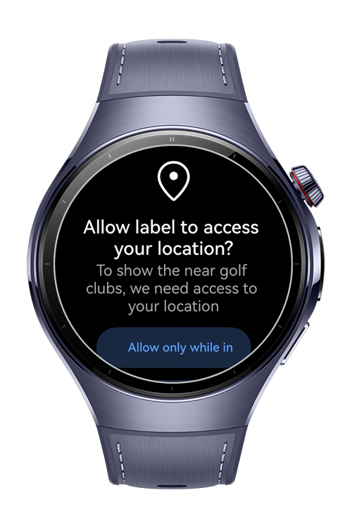
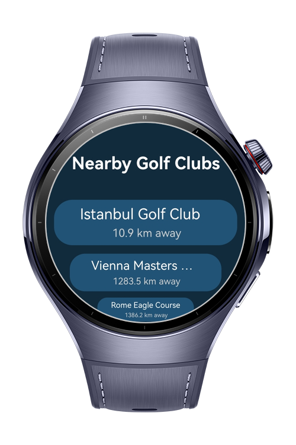
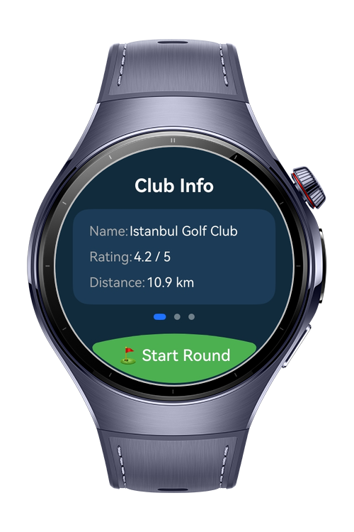
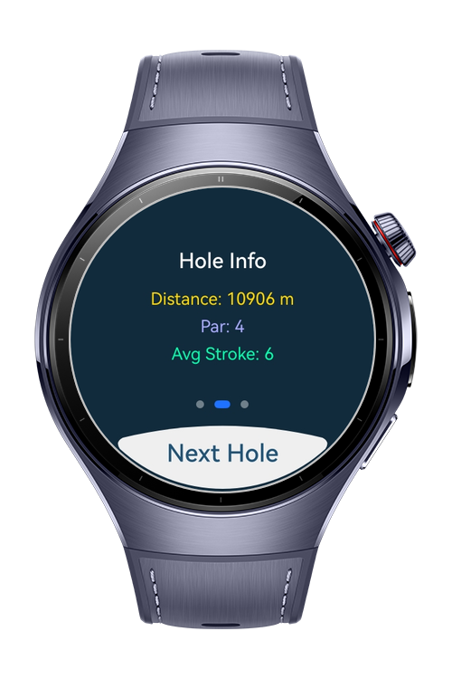

> **Note:** To access all shared projects, get information about environment setup, and view other guides, please visit [Explore-In-HMOS-Wearable Index](https://github.com/Explore-In-HMOS-Wearable/hmos-index).

# GolfGPSRangeFinder

GolfGPSRangeFinder is a **HarmonyOS Next** wearable app that helps golfers locate nearby clubs, view course details, and start a round with distance and hole tracking. Built with **ArkTS** and **ComponentV2**, the app uses **Location Kit** and modular MVVM architecture for clean, reactive UI and real-time GPS data.

# Preview

<div>
  
  
  
  
</div>

# Use Cases

- Locating nearby golf clubs based on current GPS location
- Viewing club details including holes, par, and rating
- Accessing club contact and address info
- Tracking strokes per hole with live distance to target
- Calculating GPS distance to the next hole

# Tech Stack

- **Languages**: ArkTS
- **Frameworks**: HarmonyOS SDK 5.0.5(17)
- **Tools**: DevEco Studio Vers 5.1.0.842
- **Libraries**:
  - `@kit.ArkUI`
  - `@kit.BasicServicesKit`
  - `@kit.LocationKit`

# Directory Structure

```
  entry/
├── entryability/
│ └── EntryAbility.ets
├── entrybackupability/
│ └── EntryBackupAbility.ets
├── model/
│ ├── GolfClub.ets
│ ├── ClubDetail.ets
│ └── GolfHole.ets
├── pages/
│ ├── HomeView.ets
│ ├── ClubDetailView.ets
│ ├── Index.ets
│ └── RoundView.ets
├── service/
│ └── LocationService.ets
├── util/
│ ├── GeoUtils.ets
│ └── StringHelper.ets
├── viewmodel/
│ ├── HomeViewModel.ets
│ ├── ClubDetailViewModel.ets
│ └── RoundViewModel.ets
```

# Constraints and Restrictions

## Supported Devices
- Huawei Watch 5

## Permissions
1. ohos.permission.INTERNET
2. ohos.permission.APPROXIMATELY_LOCATION
3. ohos.permission.LOCATION

# License

GolfGPSRangeFinder is distributed under the terms of the MIT License
See the [license](./LICENSE) for more information.